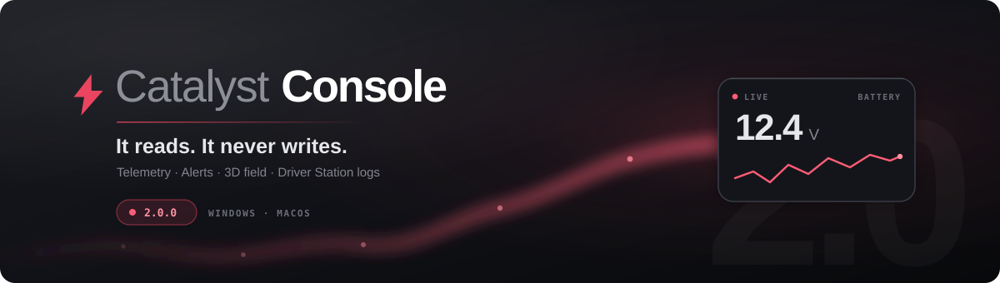

<p align="center">
  
</p>

<p align="center">
  <a href="https://github.com/TomAs-1226/CatalystConsole/releases/latest"></a>
  <a href="https://github.com/TomAs-1226/FrcCatalyst"></a>
  
  
</p>

A driver station companion for teams running [FrcCatalyst](https://github.com/TomAs-1226/FrcCatalyst).
It sits next to the NI Driver Station and shows what the robot is doing — telemetry, alerts, live
tuning, Physics Core state, a 3D field view, the robot's own spec sheet, and readable Driver Station
logs.

It is a Tauri app: a small Rust backend and a plain HTML/CSS/JS frontend running in the WebView2 that
ships with Windows. There is no framework and no bundler, and nothing it draws comes off the network —
three.js is vendored and the field is built locally, because a dashboard that needs the internet to
draw a field fails in exactly the venue it is meant for. The one request it ever makes is the update
check described below, which fails harmlessly when there is no route out. The whole installer is
under four megabytes.

---

## Install

Download the installer from [Releases](https://github.com/TomAs-1226/CatalystConsole/releases/latest)
and run it. Windows x64; nothing else to install, because WebView2 is already on the machine.

After that it updates itself: it checks once at launch, quietly, and puts a chip in the corner if
there is a newer build. Nothing downloads until you press the button, and nothing ever asks during a
match. On a field network the check simply fails, which is the normal case and is reported as such
rather than as a fault.

There is nothing to configure to see telemetry. Set your team number once in **Settings → Robot** and
the console finds the robot on its own.

## What you get

| | |
|---|---|
| **A board you build** | Tiles bound to NetworkTables keys you choose — gauges, graphs, alerts, a match clock, a 3D field. Nothing is hard-coded to a season. Drag to arrange, then export the layout as JSON and every laptop in the pit comes up the same. |
| **The robot's spec sheet** | A robot on FrcCatalyst 1.10+ introduces itself: name, team, drivetrain geometry, mass, power, the Catalyst features it runs. Drawn to scale from its own published figures. |
| **A device tree** | Every CAN device with its bus and id, and the power distribution as the board it is — so you can see which breaker feeds what and which slots are free. |
| **Live tuning** | Change a tunable and watch the robot respond, without a redeploy. |
| **Physics Core** | Slip, tipping margin, traction usage and localisation confidence, when the robot publishes them. |
| **Driver Station logs** | The `.dslog` and `.dsevents` files the DS already writes, parsed and readable — brownouts, radio drops, watchdog trips, with the timeline. |
| **Diagnostics for an agent** | A read-only MCP server, so an AI assistant can inspect the robot without being able to touch it. |

---

## The three rules

Everything in this codebase answers to these, in order.

**1. It never controls the robot.** FRC requires the official NI Driver Station, and only one DS may
hold the robot connection. Catalyst Console does not open that socket and has no code path that could.
Enable, disable, and E-stop are the Driver Station's, exclusively.

**2. Nothing it does may impede driving.** No modal blocks the dashboard. No check gates anything. No
"you must acknowledge this first". Every failure degrades to a dimmed number and a quiet chip in the
corner — if the console breaks mid-match, the driver keeps driving and does not have to notice.

This rule is why the dashboard paints on a plain 10 Hz timer rather than only on `requestAnimationFrame`:
Chromium stops firing animation frames for a window it considers occluded, and parking the Driver
Station on top of an rAF-only dashboard would freeze it with stale numbers still on screen.

**3. It never invents a number.** A topic the robot has not published shows a dash, not a plausible
value. The `.dslog` parser refuses versions it does not recognise rather than decoding them into
nonsense. Demo data exists, has to be switched on deliberately, and says so on screen while it runs.

## Is it legal at a competition?

Yes. It is a dashboard: it connects to NetworkTables and displays what it finds, which is what
Shuffleboard, Glass, Elastic, and AdvantageScope all do. It does not touch the DS protocol, does not
open a second control connection, and runs as an ordinary application on the driver station laptop.
The team is responsible for checking the current season's manual, as always — but nothing here is
outside what a dashboard normally does.

---

**One console at a time.** Launching it again does not open a second window — the new process hands
off to the one already running, raises it, and exits. Two consoles would mean two NetworkTables clients
on one robot and a driver reading whichever happened to be on top.

## Building it from source

```bash
npm install && npm run vendor && npm run dev
```

`npm run vendor` copies three.js into `src/vendor/`. It has to exist before the first build: the
webview runs under a strict CSP with `script-src 'self'`, so nothing loads from a CDN. A dashboard that
needs the internet to draw a field is a dashboard that fails in exactly the venue it is meant for.

To iterate on the UI without relinking the Rust binary:

```bash
npm run serve
```

That serves `src/` on <http://localhost:5173>. Everything renders; nothing connects, because the Tauri
bridge is not there. Switch on **Demo data** in the dock to see it populated.

To build an installer:

```bash
npm run build
```

## Diagnostics for an agent

The same binary has a second mode. `catalyst-console --mcp` opens no window and serves read-only
diagnostics over stdio as an MCP server instead — status, topics, alerts, Physics Core, match state,
Driver Station logs, the field map — so an agent can see what the robot is doing. `--help` explains
both modes.

Read-only is the whole design, not an unfinished feature: a tool that could drive would be a second
control path to a robot, which is exactly what rule 1 forbids. There is no such tool.
See [docs/mcp.md](docs/mcp.md).

## Finding the robot

The console cycles these addresses until one answers, so the same build works everywhere with no
setting to forget:

| Address | When it is the right one |
| --- | --- |
| `127.0.0.1` | simulation on this machine |
| `roborio-TEAM-frc.local` | on the field, over mDNS |
| `10.TE.AM.2` | in the pit, static IP |
| `172.22.11.2` | USB tether |

Set your team number in **Settings → Robot**, or by clicking the link chip in the top strip, which
goes to the same place. It is kept by the backend in the app's own config directory rather than in
the webview's storage, because `--mcp` has to read the same answer with no webview involved. A change
lands on the next connection attempt, about a second away while disconnected.

## Settings

One panel, opened with the gear or **S**, holding everything the console lets you change about
itself. It replaced a set of modals hanging off chips in the top strip, and About with it: there is
one place to look and one place to change.

It is a mode of the instrument rather than a window over it. Nothing in it is modal — no focus trap,
and the board behind stays live — nothing has an apply button, because a control is the truth the
moment you move it, and the whole panel stands down the instant the robot is enabled or E-stopped.
That last part is rule two: whatever the console has to say about itself, none of it is worth reading
over the top of a state lamp.

Seven sections, on a rail down the left.

| Section | What is in it |
| --- | --- |
| **Robot** | the spec sheet the robot published, units, team number, the addresses being tried |
| **Devices** | every CAN device by bus and id, and the power distribution drawn as a panel |
| **Field view** | camera, trail length, whether the baked field model is used |
| **Dashboard** | which view the console opens on, layout export and import, reset, alert hold |
| **Data** | demo data, and what it is for |
| **Updates** | installed version, the check, the release notes, install |
| **About** | the three rules, live diagnostics, the keyboard shortcuts, links |

Typing in the box above the rail filters every row in every section at once and leaves each match
where it lives, so a setting found by searching is changed the same way as one found by navigating —
it is the same row, with the handler it was built with. Escape clears the filter; a second Escape
closes the panel.

Two of them are new enough to be worth calling out:

**Units** — metric or imperial. It changes how the spec sheet reads and nothing else; the robot
always publishes SI and nothing on the wire moves. It is there because FRC writes its frame perimeter
and height rules in inches, so a team checking whether they are legal is otherwise converting by hand
at exactly the moment they cannot afford an arithmetic mistake.

**Opens on** — which view the console comes up in. A team living in Tune on a practice day should not
have to press a key every launch. Setting it deliberately does not switch the view now.

Everything except the team number is kept in local storage, validated key by key on the way back in:
a value out of range is pulled back into it and anything else falls back to the default, because a
bad number out of storage lands in a component that has no business validating a setting.

See [docs/settings.md](docs/settings.md) for the rows one at a time.

---

## The contract with the robot

The console binds to NetworkTables keys you choose, so almost nothing below is mandatory — every
component's topics are editable in its tile settings. These are the defaults and the two conventions
worth adopting.

### What it reads without being told

| Topic | Meaning |
| --- | --- |
| `/FMSInfo/FMSControlData` | control word — enabled, auto, test, E-stop, FMS and DS attached |
| `/FMSInfo/IsRedAlliance` | alliance colour, which drives the bumpers in the field view |
| `/FMSInfo/EventName`, `/FMSInfo/MatchNumber` | shown in the title strip |
| `/FMSInfo/GameSpecificMessage` | which alliance's hub goes inactive first — see below |

All of `/FMSInfo` is read-only from the console's side, enforced in `nt_set`, not just in the UI.

**The match clock is not in there.** That table carries the control word, the alliance, the event and
the game-specific message, and no time at all — so robot code has to publish one:

```java
CatalystLog.log("Match/TimeLeft", DriverStation.getMatchTime());
```

The console tries `/Catalyst/Match/TimeLeft`, then `/SmartDashboard/MatchTime`, then
`/FMSInfo/MatchTime`, and takes the first that exists. With none of them the match timer and the hub
countdown show dashes rather than counting down from a number nobody published.

### The robot's own account of itself

A robot running FrcCatalyst 1.10 or later publishes a spec sheet under `/Catalyst/Robot/`, and
**Settings → Robot** shows it: the name, a plan of the chassis drawn to scale from the frame, bumper
and module figures on the wire, and the specification grouped as software, controller, drivetrain,
chassis, traction, power and hardware. Adopting it is one line in `RobotContainer`:

```java
RobotIdentity.declare("Ratchet");
```

Everything else is derived. The library reads the team number, the roboRIO and its image, its own
version, WPILib's, the CAN inventory, the gyro, and — once a `SwerveSubsystem` exists — the module
positions, track width, wheelbase and top speed. Gear ratios are the exception: Phoenix will not hand
them back from a constructed drivetrain, so they appear only if you pass the module constants to the
builder.

From 1.11 the sheet leads with which parts of the library the robot actually runs — Autopilot,
Strategist, Sequence, Goal Director, Physics Core — each recorded by the component as it is built
rather than declared anywhere. Two robots can have the same drivetrain and the same motor count and
still be completely different machines, and this is the only part of the sheet that says so.

The console draws only what arrived. A key the robot did not publish produces no row, and a group
with nothing in it produces no group — so a robot with no swerve shows no drivetrain section rather
than a column of zeros. A dash there would say *this robot has no gyro*; absence says *it did not
mention one*, and only the second is true. It is the same rule three the rest of the console answers
to, and it is why the plan is drawn from the published dimensions rather than from a stock picture:
wrong dimensions look wrong.

**Copy the spec sheet** writes the whole thing out as plain text, in whatever units are selected. At
inspection someone is reading frame perimeter and weight off a screen and writing them on a form;
this is that, without the transcription.

Switch on **Demo data** to see the panel populated without a robot. The demo sheet is deliberately
incomplete, because a partial sheet is the ordinary case.

The whole of it is in [docs/robot-identity.md](docs/robot-identity.md).

### Alerts

Nothing to do if you use Catalyst's `AlertManager` — it already publishes string arrays at:

```
/Catalyst/Alerts/Errors
/Catalyst/Alerts/Warnings
/Catalyst/Alerts/Info
```

WPILib's own `Alerts` widget uses lowercase `errors` / `warnings` / `infos` instead. The tile reads
whichever is present rather than making you pick, and the group path is configurable, so an existing
`/SmartDashboard/Alerts` works unchanged.

### Live tuning

The robot declares what it is willing to let a dashboard change. Publish one JSON string:

```
/Catalyst/Tunables/.manifest
```

containing an array of entries:

```json
[
  { "key": "/Catalyst/Tunables/shooter.kP",
    "name": "Shooter kP",
    "group": "Shooter",
    "min": 0, "max": 2, "step": 0.001 },

  { "key": "/Catalyst/Tunables/shooter.target",
    "name": "Target speed",
    "group": "Shooter",
    "min": 0, "max": 6000, "step": 25, "unit": "RPM" },

  { "key": "/Catalyst/Tunables/physics.enabled",
    "name": "Physics advisories",
    "group": "Physics Core" }
]
```

Only `key` is required — a missing `name` falls back to the last segment of the key, and a missing
`group` to "General". What decides the control is the value's own type on the wire: a boolean renders
as a toggle and anything else as a slider, with the readout showing exactly as many decimals as `step`
can resolve. Declaring `min`/`max` on a boolean does not turn it into a slider.

The console shows what is in that list and nothing else. It never infers that a topic looks tunable, so
a value you did not declare cannot be changed from here. Writes go straight to `key` — persist anything
worth keeping on the robot, because a reboot returns to whatever the code says.

### Physics Core

Optional. When these exist the Physics Core tile lights up; when they do not, it shows dashes.

These are what `PhysicsCore` publishes on its own once you construct one — no extra wiring.

| Topic | Type | Meaning |
| --- | --- | --- |
| `/Catalyst/Physics/PoseArray` | `double[3]` | `[x, y, theta]` in metres and radians, WPILib field coordinates |
| `/Catalyst/Physics/Pose` | `Pose2d` struct | the same pose for AdvantageScope; the console reads the array |
| `/Catalyst/Physics/Slip/Factor` | `double` | 0 = gripping, 1 = fully slipping |
| `/Catalyst/Physics/TippingUsage` | `double` | fraction of the tipping limit in use |
| `/Catalyst/Physics/TractionUsage` | `double` | fraction of the traction limit in use |
| `/Catalyst/Physics/Quality/Confidence` | `double` | estimator confidence, 0–1 |

Slip, tipping and traction are all "fraction of the limit in use", so all three read the same way
round: higher is worse.

The Impacts tile reads the collision group Physics Core writes when it detects a contact it cannot
explain any other way:

| Topic | Type |
| --- | --- |
| `/Catalyst/Physics/Collision/Timestamp` | `double` |
| `/Catalyst/Physics/Collision/MpsSq` | `double` |
| `/Catalyst/Physics/Collision/Newtons` | `double` |

A new timestamp is what marks a new hit, rather than the same one still being reported.

The tile says *advisory only* on its face, deliberately. Physics Core has been validated in simulation
and has never run on carpet; nothing on this dashboard should be gating a driver decision yet.

### Health

| Topic | Published by |
| --- | --- |
| `/Catalyst/Loop/Robot/AverageMs` | `LoopMonitor`, once you construct one |
| `/Catalyst/Brownout/MeasuredVoltage` | `BrownoutMonitor`, once you construct one |
| `/Catalyst/Status/CanUtilization` | nothing — see below |

Neither WPILib nor Catalyst puts CAN utilisation or raw battery voltage on NetworkTables by itself. One
line each in `robotPeriodic()` if you want them without the monitors:

```java
CatalystLog.log("Status/CanUtilization", RobotController.getCANStatus().percentBusUtilization);
CatalystLog.log("Status/BatteryVolts", RobotController.getBatteryVoltage());
```

Note the keys are relative — `CatalystLog`'s sink supplies the `Catalyst` root table, so they land at
`/Catalyst/Status/...`. Then point the tiles at those keys instead.

### Auto chooser

Standard `SendableChooser`. The console reads `options` and `selected` under the chooser path and
writes `selected` when you pick one — the same key Shuffleboard writes.

---

## Components

Add, remove, resize, and rearrange from the dock. The layout persists locally, and is exported and
imported from **Settings → Dashboard**.

A stored board that cannot be read does not take the console with it. Each tile is checked on the way
out of storage and an unreadable one is dropped with a warning to the console log — silence and nine
of ten tiles beats a dialog and none — and if building the board throws anyway, the console falls
back to the layout it ships with and carries on. That is not tidiness: the build runs at module
scope, so a throw there used to abort the rest of the file, taking the repaint loop, the keyboard
listener and the panel stand-down with it and leaving a driver an empty board that still looked
healthy. Storage is left untouched either way, because the board that could not be built is still the
board somebody arranged.

| Component | Notes |
| --- | --- |
| **Match timer** | phase, shift name, and countdown, with the match shape as three bars |
| **Hub activation** | see below |
| **Impacts** | contacts Physics Core detected, how hard and how long ago |
| **Swerve modules** | four module angles and speeds, drawn as they are actually pointing |
| **Gauge** | any numeric topic as an arc, dial, bar, or number |
| **Field view** | the robot on the field in 3D, from the pose estimator |
| **Battery** | voltage with rolling history and measured sag |
| **Loop & bus** | loop time against budget, CAN utilisation, round-trip time |
| **Physics Core** | slip, tip margin, traction headroom |
| **Alerts** | whatever the alert manager is raising |
| **Auto chooser** | pick the routine |
| **Graph** | rolling plot of one topic |
| **Value**, **Indicators** | one number large; a row of booleans as lamps |
| **Stopwatch**, **Note** | cycle timing; text that stays with the layout |

### The gauge

One tile takes one topic or several comma-separated. With several, labels are derived from the
shortest path suffix that actually distinguishes them — four keys ending in `/Velocity` come out as
FrontLeft / FrontRight / BackLeft / BackRight rather than "Velocity" four times.

`Multiply by` exists because Phoenix 6 reports rotations per second; ×60 gives RPM. Set it to 1 for a
raw value.

### Hub activation

In REBUILT your alliance HUB stops scoring for part of teleop, so the tile answers one question from
across the drive station: **is ours active, and how long until that changes.** Colour carries it —
green while active, amber in the last few seconds before a change, flat grey while inactive — with the
countdown large underneath.

Terminology, because the manual is specific and it matters here: the **HUB** is the fuel goal, and it
is the thing that goes active and inactive. The **TOWER** is the climbing structure in the alliance
wall, with its three rungs. This tile is about the hub.

It works the schedule out itself, from the rules plus what FMS sends, rather than needing the robot to
tell it. Teleop runs 140 s in six segments (2026 Game Manual, Table 6-2):

| Segment | Time remaining | Hubs |
| --- | --- | --- |
| Transition shift | 2:20 – 2:10 | both active |
| Shift 1 | 2:10 – 1:45 | alternating |
| Shift 2 | 1:45 – 1:20 | alternating |
| Shift 3 | 1:20 – 0:55 | alternating |
| Shift 4 | 0:55 – 0:30 | alternating |
| End game | 0:30 – 0:00 | both active |

Through shifts 1–4 the alliance that scored **more fuel in AUTO** is inactive for shift 1 and then
alternates. FMS relays which alliance that was in the game-specific message at the start of teleop, so
the console reads `/FMSInfo/GameSpecificMessage` and `/FMSInfo/IsRedAlliance` and derives the rest
exactly — no estimating.

Before that message arrives it says so rather than guessing, because during shifts the answer genuinely
depends on an auto result nothing else can infer. Auto, the transition shift and end game need no game
data at all: both hubs are active by rule, and the tile says that.

If your robot would rather compute it itself, publish a boolean and a countdown and configure the tile
to read them — a robot-published answer always wins.

### The field view

The field is drawn procedurally from its dimensions — carpet, perimeter, driver station glass, the
centre and alliance lines — and the robot is drawn from the pose estimator with a heading wedge, a
trail, and bumpers in your alliance colour. Three camera modes: chase, overhead, free orbit.

There are two versions of it, and the app picks whichever it can.

**The real field.** The KOP CAD download ships a glTF binary alongside the SolidWorks assembly, so no
STEP conversion is needed — but it is 223 MB and 6.8 million vertices, which is a fine marketing asset
and a terrible dashboard one. Bake it down once:

```bash
npm run field-cad
```

That finds `Field_2026.zip` in your Downloads (or takes a path), pulls the `.glb` out, and decimates it
to about **190k vertices and 6 MB** — a 36× reduction that still reads as the REBUILT field, hubs,
towers and fuel included. It lands in `src/vendor/field.glb` and is deliberately **not committed**: it
is FIRST's model rather than ours, and every team already has the download.

Materials are re-grounded on load rather than used as shipped. The KOP model is lit for a render, so
its unpainted parts arrive near-white — a slab of glare in a dark cockpit that pulls your eye away from
the robot. Each material keeps its hue, so alliance red and blue still read, but saturation and
lightness come right down and the field recedes behind the thing you are actually watching.

**The outline.** With no baked model the view draws the field procedurally from its dimensions —
carpet, perimeter, driver station glass, centre and alliance lines. That is not a placeholder to
apologise for: it is what renders on a machine that has never seen the CAD, and it is the version that
always works.

Either way dimensions default to the REBUILT carpet — 651.2 in × 317.7 in, or 16.54 m × 8.07 m, from
the
[2026 field drawings](https://firstfrc.blob.core.windows.net/frc2026/FieldAssets/2026-field-dimension-dwgs.pdf) —
and both are editable in the tile settings. The official model lives on FIRST's
[Playing Field page](https://www.firstinspires.org/resources/library/frc/playing-field).

The robot is still drawn procedurally. The KitBot CAD in the same download is SolidWorks-only with no
glTF beside it, so there is nothing to convert without SolidWorks on the machine — and a bumpered box
with a heading wedge tells a driver where they are pointing better than a faithful mesh would at this
size.

Cost control, because this shares a laptop with the Driver Station: 30 fps, no shadows, no textures, no
post-processing, ~30 meshes, rendering stops entirely when the dashboard tab is not showing, and
three.js is only fetched at all when a field tile exists in the layout.

---

## Driver Station logs

The NI Driver Station writes two files per session into `C:\Users\Public\Documents\FRC\Log Files`:

* `.dsevents` — timestamped text: radio drops, brownouts, watchdog trips
* `.dslog` — fixed-rate trip time, packet loss, battery, CPU

Some of that exists nowhere else. The robot never sees its own packet loss, because the packets that
would have told it are the ones that went missing.

The Logs tab reads both and lays them out as a timeline with severity, plus battery, trip-time and
packet-loss traces. The formats are community-reverse-engineered rather than documented by NI, so the
parser fails closed: a header it does not recognise is reported as unparsed, and the event log is still
shown, because inventing a battery voltage would be worse than admitting the file cannot be read.

---

## Layout of the source

```
src-tauri/src/main.rs     Tauri commands, the address list, the write guard, and the two modes
src-tauri/src/nt4.rs      NetworkTables 4 client — WebSocket, msgpack, 20 Hz batched flush
src-tauri/src/dslog.rs    .dslog / .dsevents parsers
src-tauri/src/mcp.rs      the read-only diagnostics MCP server behind --mcp
src/index.html            the shell: top strip, views, dock, the two component modals, Settings
src/styles.css            the design system
src/app.js                NT store, component registry, layout, every component
src/field3d.js            the procedural 3D field
```

`nt4.rs` batches values into a map and flushes on a fixed cadence rather than emitting at wire rate.
The robot publishes at 50 Hz across hundreds of topics; pushing each change straight into the webview
would spend the whole frame budget in IPC. UI cost is independent of how chatty the robot is.

---

## Documentation

| | |
|---|---|
| [Installing and updating](docs/installing.md) | Getting it onto a driver station laptop, and how updates work. |
| [Settings](docs/settings.md) | Every section and every row, plus search and where each setting is stored. |
| [The robot's spec sheet](docs/robot-identity.md) | What a robot publishes about itself, and the one line of robot code that starts it. |
| [Components](docs/widgets.md) | Every tile, what it binds to, and how to configure it. |
| [Hub activation](docs/hub-schedule.md) | How the REBUILT hub schedule is derived from the rules and the FMS game data. |
| [Diagnostics MCP](docs/mcp.md) | The read-only tool surface, for agents. |

## Licence and credits

Built for FRC teams running FrcCatalyst. The field model is derived from the published REBUILT field
CAD; the game rules it encodes come from the season manual, and the manual is always the authority.

If something here disagrees with what your robot is actually doing, trust the robot — and please open
an issue, because a dashboard that is confidently wrong is worse than one that says it does not know.
